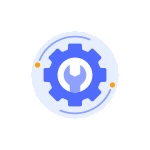

## Sobre mí

**Apasionada por el mundo de las tecnologías**, estoy en pleno proceso de especialización en desarrollo de software y aplicaciones multiplataforma.  
Disfruto del reto de **crear soluciones tecnológicas y ver cómo cobran vida a través del código**, combinando mis competencias técnicas con una visión creativa y centrada en las personas.  
Además, mi experiencia previa en Trabajo Social me ha aportado habilidades como la empatía, la asertividad y la toma de decisiones bajo presión, cualidades que enriquecen mi forma de abordar cada proyecto.  
Me considero una profesional con un enfoque colaborativo, orientada a resolver problemas y a mejorar la experiencia de los usuarios.  

##  Formación

- Ciclo Superior en Desarrollo de Aplicaciones Multiplataforma (DAM) – 1º curso  
- Programación **Java** Básico
- **Java**: Fundamentos de la programación orientada a objetos

## Conocimientos

## Contacto

  
  

## GitHub Stats 

  
  

 

  
Gracias por pasarte por aquí

  
¡Siempre encantada de aprender, crear y disfrutar del código!

